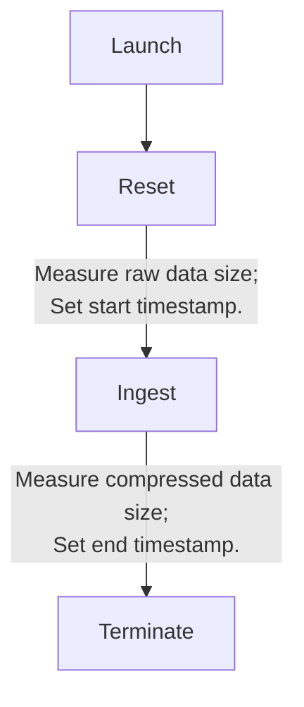
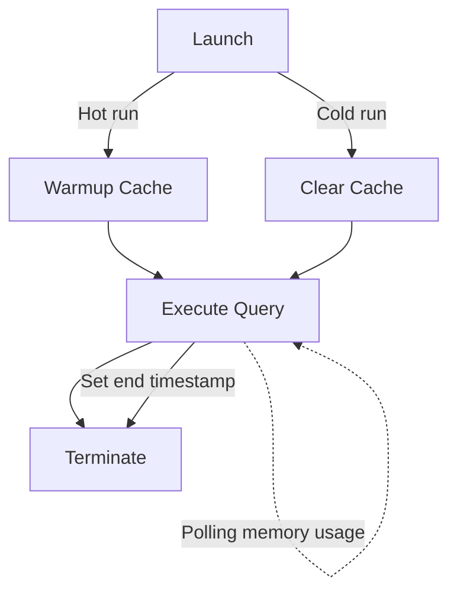

# Methodology

Below we describe the methodology used to benchmark [CLP] and other tools.

## Test datasets

There are two types of logs used in the benchmark:
* **Unstructured logs** are log events that don't follow a predefined format or structure, making it
  difficult to automatically parse or analyze them. Unstructured logs are often just text
  interspersed with variable values like the log event's timestamp, log-level, and others such as
  usernames, etc. For example:
  

```
  2018-06-05 06:15:29,701 DEBUG org.apache.hadoop.util.Shell: setsid exited with exit code 0
  ```

* **Semi-structured logs** do have follow a predefined format, making them parseable, but their
  schema is not rigid. Semi-structured log events usually have a few consistent fields (e.g., the
  event's timestamp and log level) but the rest may appear and disappear across each event. For
  example:

  

```json
  {
      "t": {
          "$date": "2023-03-21T23:34:54.576-04:00"
      },
      "s": "I",
      "c": "NETWORK",
      "id": 4915701,
      "ctx": "-",
      "msg": "Initialized wire specification",
      "attr": {
          "spec": {
              "incomingExternalClient": {
                  "minWireVersion": 0,
                  "maxWireVersion": 17
              },
              "incomingInternalClient": {
                  "minWireVersion": 0,
                  "maxWireVersion": 17
              },
              "outgoing": {
                  "minWireVersion": 6,
                  "maxWireVersion": 17
              },
              "isInternalClient": true
          }
      }
  }
  ```

The unstructured log dataset, hadoop-25GB, contains log events generated by Hadoop when running
workloads from the HiBench Benchmark Suite on three Hadoop clusters, each containing 48 data nodes.
The dataset is a 258 GiB subset of a larger [14 TiB][hadoop-14TB] dataset (specifically, workers
1-3).

The semi-structured log dataset, [mongodb], contains log events generated by MongoDB when running
YCSB workloads A-E repeatedly. The dataset is 64.8 GiB and contains 186, 287, 600 log events. We 
concatenate the logs into a single file for benchmarking.

## Benchmark machines

Where we report benchmark results, we use a Linux server with Intel Xeon E5-2630v3 processor and
128GB of DDR4 memory. Both the uncompressed and compressed logs are stored on a 7200RPM SATA HDD.

## Test runtime scenarios

We evaluate two runtime scenarios for query benchmarking with each tool:

* **Hot run**: In this scenario, we run the query multiple times to warm up the cache, then execute 
  the query again to measure end-to-end latency.
  + _Note_: In the future, we plan to warm up the system by running the benchmark until results 
    stabilize before collecting final measurements.

* **Cold run**: Here, we clear the page cache and any internal cache of the tool (if applicable), 
  then run the query to measure end-to-end latency.

## Metrics collected

### Ingest time

This measures the time taken to ingest the data. Smaller values are better indicating faster
ingestion performance.

### Compressed size

This measures the on-disk size of the data, post-ingestion, in the tool being tested. We measure it
using `du <data> -bc` . Smaller values are better indicating higher compression.

### Average memory usage

This measures average memory usage, separately, for the ingestion and query stages. Smaller values
are better indicating lower resource usage.

There are two collection methods based on how the tools being tested run:
* For tools running with multiple microservices (e.g., Loki), we use `docker stats` to poll the
  total memory usage of all related containers, then average the results.
* For other tools, we use `ps` to poll the `RSS` (resident-set size) field for all related
  processes, then average the results.

### Query latency

This measures the time taken to completely execute a query. Smaller values are better indicating
faster query performance.

# Tested tools

The benchmark currently tests the following tools:
* For unstructured logs:
  + [CLP][glt] (📐[methodology][glt-methodology]). Specifically, the `glt` binary.
  + [Elasticsearch] (📐[methodology][Elasticsearch-unstructured-methodology]).
  + [Loki] (📐[methodology][Loki-methodology]).
  + `grep` (📐[methodology][grep-methodology]).
* For semi-structured logs:
  + [CLP-S][clp-s] (📐[methodology][clp-s-methodology]).
  + [Elasticsearch] (📐[methodology](Elasticsearch-semi-structured-methodology)).
  + [MongoDB] (📐[methodology][MongoDB-methodology]).
  + [ClickHouse] (📐[methodology][ClickHouse-methodology]).
# Workflow

clp-bench divides the benchmarking into two parts: **ingest** and **query benchmarking**. The 
workflow of ingesting data:


The workflow of query benchmarking:


[hadoop-14TB]: https://zenodo.org/records/7114847
[mongodb]: https://zenodo.org/records/11075361

[CLP]: https://github.com/y-scope/clp

[glt]: https://docs.yscope.com/clp/main/user-guide/core-unstructured/glt.html
[glt-methodology]: ../assets/unstructured/glt/methodology.md

[Elasticsearch]: https://www.elastic.co/downloads/elasticsearch
[Elasticsearch-unstructured-methodology]: ../assets/unstructured/elasticsearch/methodology.md

[Loki]: https://grafana.com/oss/loki/
[Loki-methodology]: ../assets/unstructured/loki🚧/methodology.md

[grep-methodology]: ../assets/unstructured/grep/methodology.md

[clp-s]: https://docs.yscope.com/clp/main/user-guide/core-clp-s.html
[clp-s-methodology]: ../assets/semi-structured/clp-s/methodology.md

[Elasticsearch-semi-structured-methodology]: ../assets/semi-structured/elasticsearch/methodology.md

[MongoDB]: https://www.mongodb.com/
[MongoDB-methodology]: ../assets/semi-structured/mongodb/methodology.md

[ClickHouse]: https://clickhouse.com/
[ClickHouse-methodology]: ../assets/semi-structured/clickhouse/methodology.md
